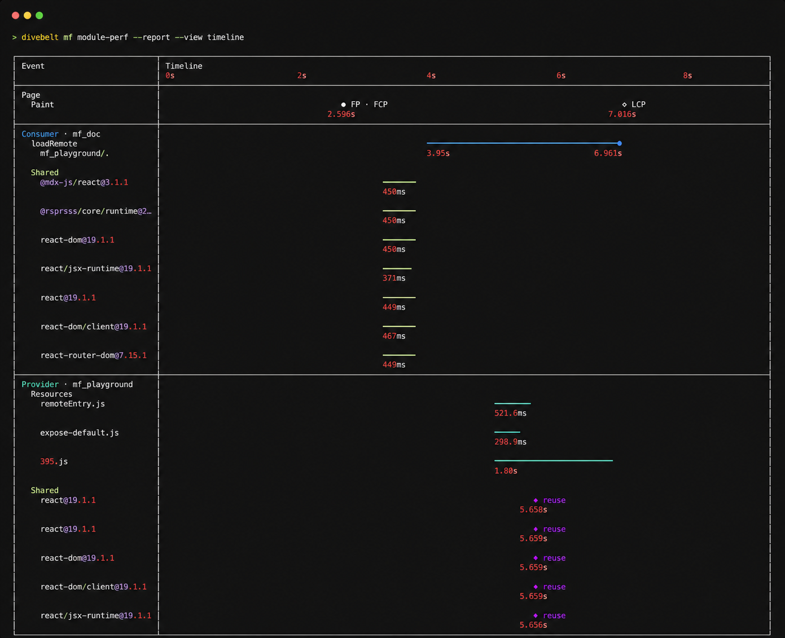

<p align="center">
  
</p>

<h1 align="center">Divebell</h1>

<p align="center">
<b>Go below the surface.</b>
<br/>
An extensible toolkit for coding agents to debug, understand, and verify real web applications.
</p>

---

Agent entry point: [Divebell Skill](./skills/divebell/SKILL.md)

# Divebell

Divebell is an **extensible toolkit for coding agents to debug, understand, and verify real web applications**.

Divebell makes the web page the coding agent's point of entry. It connects page context, browser capabilities, and the team's existing development and debugging tools so the agent can reproduce, diagnose, and verify issues directly in real web scenarios.

Starting from the current page, an agent can call existing SDKs, OpenAPIs, CLIs, and diagnostic capabilities without requiring a person to extract page information and connect the tools first.

The coding agent reads and modifies code. Divebell prepares reusable browser context and exposes page operations, browser diagnostics, and result verification as directly callable capabilities. Teams can use Extensions to connect their own accounts, environments, internal platforms, focused diagnostics, and verification workflows.

---

## Quick Start

Install the Divebell CLI globally once:

```bash
npm install --global @divebell/cli
divebell setup
```

The npm global CLI uses a 12-hour version-cache window and checks after an
ordinary command finishes when that cache is stale. The check and any upgrade
run in a detached background process, so the completed command does not wait.
Failed or pending upgrades are throttled before retrying. Check explicitly or
update immediately with:

```bash
divebell update --check
divebell update
```

Source checkouts, temporary `npx` executions, and project-local installations
are not changed automatically. Set `DIVEBELL_NO_AUTO_UPDATE=1` to disable the
background behavior.

Install the Module Federation Extension, open the public playground with MF
diagnostics enabled, and render its observed module loading directly in the
terminal:

```bash
divebell extensions add @divebell/extension-mf
divebell open https://module-federation.io/playground/index.html --mf
divebell mf module-perf --report --view timeline
```

Example output (the observed timings vary between navigations):



`divebell setup` checks the environment and repairs browser startup only when
needed. Its browser probe runs in a temporary session and cleans that session up
when setup finishes.

In a coding-agent sandbox, Divebell automatically moves its own files and the
bundled browser's files to private temporary directories when the normal user
directories are read-only. Set `DIVEBELL_HOME` and `AGENT_BROWSER_HOME` only
when those files need specific durable writable locations.

Install the [Divebell Skill](./skills/divebell/SKILL.md) in your agent.

## Why Divebell

Coding agents can already read and modify code, and they can call many development tools. But real web development issues usually happen in the page itself: users see a page, while diagnosing the problem requires its state, runtime environment, business context, and the team's existing diagnostic capabilities.

That information and those capabilities are usually scattered across:

- User actions and runtime state on the page
- Browser diagnostics such as Console and Network
- Existing SDKs, OpenAPIs, CLIs, and internal platforms

An agent often still needs a person to explain what the current page represents and which capability to call next.

Divebell makes the web page the agent's point of entry, connecting page context, browser diagnostics, and the team's existing tools so the agent can reproduce, diagnose, and verify issues directly in the real scenario.

Teams can use Extensions to bring existing capabilities into the current page scenario without rebuilding a separate tool system for agents. Once a workflow works, other agents and CI can keep using it as a durable team asset.

## Core Capabilities

| Module | Responsibility | Entry point | Page integration required |
| --- | --- | --- | --- |
| Web Context & Diagnostics | Make a real web page the agent's point of entry and provide page context, browser diagnostics, and same-scenario verification | Divebell CLI | No |
| Extensions | Connect the web page with the team's existing development and debugging capabilities | CLI commands, Extension API | No |
| Runtime SDK | Expose application-internal facts that cannot be observed from the page without polluting the runtime environment | `@divebell/core`, framework plugins | Yes |

### Web Context & Diagnostics

Divebell makes a real web page the agent's point of entry, providing page context, page operations, browser diagnostics, and same-scenario verification after a code change.

These capabilities include the current page and user journey, page operations such as `click`, `fill`, and `eval`, diagnostic evidence from Console, Network, Screenshot, and Coverage, and page-declared WebMCP tools. Divebell enables Chrome's experimental WebMCP support for local Chrome launches by default, and Agents can call the tools directly through the Divebell CLI without Runtime SDK.

[CLI Reference](./docs/cli-reference.md) · [WebMCP](./docs/webmcp.md)

For protected pages, Divebell uses a read-only copy of the current OS user's most recently used Chrome Profile by default. An explicitly supplied Profile, browser state, restore context, restricted-domain mode, or external browser takes precedence. Divebell always works within the selected account's existing permissions.

When no local Chrome Profile is available, Divebell falls back to project-scoped automatic Restore State. Restore State contains cookies, localStorage, and sessionStorage rather than a complete Chrome Profile. Divebell saves it once after a newly opened page is quiet for about two seconds and again before close, while periodic saving is disabled by default. Pass `--no-default-profile` for one `open`, or set `DIVEBELL_DEFAULT_CHROME_PROFILE=off` persistently, to use Restore State instead of automatic Profile selection.

[Browser Authentication and State](./docs/browser-auth.md)

When a script must manage the complete browser flow, see [Automating with Divebell CLI](./docs/cli-automation-scripts.md).

### Extensions

Extensions are the mechanism for connecting a web page with the team's existing development capabilities.

An Extension can identify applications, environments, and resources from the current page, call existing SDKs, OpenAPIs, CLIs, or internal platforms, and expose diagnostic and verification workflows that previously required a person to connect them.

[Using Extensions](./docs/extensions.md) · [CLI Extension Development](./docs/cli-extensions.md) · [Extension API Reference](./docs/extension-api.md)

#### Official Extensions

Focused CLI capabilities are published as optional packages and installed only when needed.

##### CLI Extensions

These packages are installed into Divebell and add top-level commands:

| Package | Entry | Purpose | Guide |
| --- | --- | --- | --- |
| `@divebell/extension-memory` | `divebell memory` | Repeat a real page journey and check memory, DOM-node, and listener growth. | [Memory Analysis](./docs/memory-analysis.md) |
| `@divebell/extension-code-usage` | `divebell code-usage` | Map recorded code execution back to chunks, source files, and dependencies. | [Code-Usage Analysis](./docs/code-usage-analysis.md) |
| `@divebell/extension-imitate` | `divebell record` | Record, review, supplement, and verify an authenticated browser workflow before generating its JavaScript replay. | [Record Browser Workflows](./docs/record-browser-workflows.md) |
| `@divebell/extension-mf` | `divebell mf` | Inspect Module Federation instances, remotes, shared dependencies, module performance, Bridge operations, and loading traces. | [MF Extension](./packages/extensions/mf/README.md) |
| `@divebell/extension-rstack` | `divebell rstack` | Detect and observe Rspack HMR, page reloads, and optional React Refresh through compiled-JavaScript evidence; MF ownership evidence is optional. | [Rstack HMR Extension](./packages/extensions/rstack/README.md) |

Install a CLI Extension with:

```bash
divebell extensions add @divebell/extension-memory
```

Installed Extension commands appear in `divebell --help` and run through the same CLI, browser sessions, and login state as the built-in commands.

### Runtime SDK

Runtime SDK is an optional page-side API. When the DOM, Console, Network, and other browser information cannot represent application state reliably, Runtime SDK can expose more granular application-internal facts to the agent.

It supports registering Targets, updating Snapshots, recording Events, declaring Actions, and running `waitFor`. Divebell works without Runtime SDK, and regular pages do not need to integrate it.

[Runtime SDK API](./docs/runtime-sdk-api.md)

## Contribution

Please read the [contributing guide](./CONTRIBUTING.md) and let's build Divebell together.

## Credits

Divebell uses [agent-browser](https://github.com/vercel-labs/agent-browser) as its default browser execution layer. Thanks to the agent-browser authors and contributors.

Extensions execute local code. Install and load only trusted content. Login-state files contain sensitive data and should remain in trusted environments.

## License

Divebell is [MIT licensed](./LICENSE).
