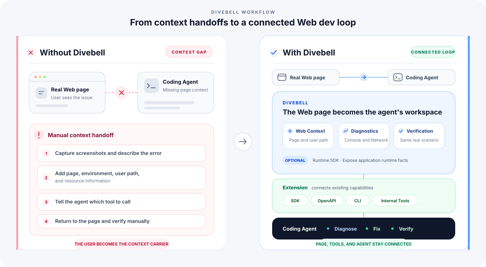

<p align="center">
  
</p>

<h1 align="center">Divebell</h1>

<p align="center">
<b>Go below the surface.</b>
<br/>
An extensible toolkit for coding agents to debug, understand, and verify real web applications.
</p>

---

English | [中文](./README.zh-CN.md)

Agent entry point: [Divebell Skill](./skills/divebell/SKILL.md)

# Divebell

Divebell is an **extensible toolkit for coding agents to debug, understand, and verify real web applications**.

Divebell makes the web page the coding agent's point of entry. It connects page context, browser capabilities, and the team's existing development and debugging tools so the agent can reproduce, diagnose, and verify issues directly in real web scenarios.

Starting from the current page, an agent can call existing SDKs, OpenAPIs, CLIs, and diagnostic capabilities without requiring a person to extract page information and connect the tools first.

The coding agent reads and modifies code. Divebell prepares reusable browser context and exposes page operations, browser diagnostics, and result verification as directly callable capabilities. Teams can use Extensions to connect their own accounts, environments, internal platforms, focused diagnostics, and verification workflows.

---

## Quick Start

Install the Divebell CLI globally once:

```bash
npm install --global @divebell/cli
divebell check --fix
divebell --help
```

Try the hosted operations playground—no repository clone or source checkout
required:

[Open the playground](https://2heal1.github.io/divebell/quickstart/) ·
[Follow the Agent-guided walkthrough](./docs/quick-start.md)

After installing the CLI and the
[Divebell Skill](./skills/divebell/SKILL.md), ask:

```text
Use Divebell to complete the official Quick Start. Operate the order page,
trigger and diagnose the inventory failure, recover it through the
page-declared action, and finish by opening a Code Usage report.
```

## Why Divebell

Coding agents can already read and modify code, and they can call many development tools. But real web development issues usually happen in the page itself: users see a page, while diagnosing the problem requires its state, runtime environment, business context, and the team's existing diagnostic capabilities.

That information and those capabilities are usually scattered across:

- User actions and runtime state on the page
- Browser diagnostics such as Console and Network
- Existing SDKs, OpenAPIs, CLIs, and internal platforms

An agent often still needs a person to explain what the current page represents and which capability to call next.

Divebell makes the web page the agent's point of entry, connecting page context, browser diagnostics, and the team's existing tools so the agent can reproduce, diagnose, and verify issues directly in the real scenario.

Teams can use Extensions to bring existing capabilities into the current page scenario without rebuilding a separate tool system for agents. Once a workflow works, other agents and CI can keep using it as a durable team asset.

## What Divebell Changes

<p align="center">
  
</p>

Divebell reduces the cost of connecting web pages with agent capabilities. Users no longer need to carry context between the page, development tools, and the agent.

## A Real Web Issue Debugging Flow

Consider a user reporting, "The page shows an error after I click Submit":

1. The agent opens the real web page, follows the relevant user journey, and reproduces the issue.
2. Divebell collects page context and diagnostic evidence such as Console, Network, screenshots, and runtime state.
3. When business information is needed, an Extension uses the current page to connect existing SDKs, OpenAPIs, CLIs, or internal platforms.
4. The coding agent modifies the source code based on the diagnosis.
5. Divebell returns to the same page scenario to verify the change.

The point of Divebell is not to teach an agent how to operate a browser. It is to make the web page a scenario where the agent can work directly.

See [Coding Agent Development Debugging Loop](./docs/agent-devloop.md) for the complete workflow.

## Core Capabilities

| Module | Responsibility | Entry point | Page integration required |
| --- | --- | --- | --- |
| Web Context & Diagnostics | Make a real web page the agent's point of entry and provide page context, browser diagnostics, and same-scenario verification | Divebell CLI | No |
| Extensions | Connect the web page with the team's existing development and debugging capabilities | CLI commands, Extension API | No |
| Runtime Core | Expose application-internal facts that browser information cannot represent reliably | `@divebell/core`, framework plugins | Yes |

### Web Context & Diagnostics

Divebell makes a real web page the agent's point of entry, providing page context, page operations, browser diagnostics, and same-scenario verification after a code change.

These capabilities include the current page and user journey, page operations such as `click`, `fill`, and `eval`, and diagnostic evidence from Console, Network, Screenshot, and Coverage. Agents can call them directly through the Divebell CLI without Runtime Core.

[CLI Reference](./docs/cli-reference.md)

For protected pages, Divebell can reuse an existing Chrome profile, browser state, or encrypted credentials explicitly supplied by the user, and work within the account's existing permissions.

[Browser Authentication and State](./docs/browser-auth.md)

When a script must manage the complete browser flow, see [Automating with Divebell CLI](./docs/cli-automation-scripts.md).

### Extensions

Extensions are the mechanism for connecting a web page with the team's existing development capabilities.

An Extension can identify applications, environments, and resources from the current page, call existing SDKs, OpenAPIs, CLIs, or internal platforms, and expose diagnostic and verification workflows that previously required a person to connect them.

[Using Extensions](./docs/extensions.md) · [CLI Extension Development](./docs/cli-extensions.md) · [Extension API Reference](./docs/extension-api.md)

#### Official Extensions

Focused capabilities are published as optional packages and installed only when needed. CLI Extensions add commands outside the page; framework integrations run inside the application and expose facts that the framework already knows:

| Package | Entry | Purpose | Guide |
| --- | --- | --- | --- |
| `@divebell/extension-memory` | `divebell memory` | Repeat a real page journey and check memory, DOM-node, and listener growth. | [Memory Analysis](./docs/memory-analysis.md) |
| `@divebell/extension-code-usage` | `divebell code-usage` | Map recorded code execution back to chunks, source files, and dependencies. | [Code-Usage Analysis](./docs/code-usage-analysis.md) |
| `@divebell/extension-imitate` | `divebell record` | Record a browser walkthrough and generate a reusable script draft. | [Record Browser Workflows](./docs/record-browser-workflows.md) |
| `@divebell/extension-troubleshooting` | `divebell verify` | Verify that a page-declared business target reaches the expected result. | [Runtime Core API](./docs/runtime-core-api.md) |
| `@divebell/modern-plugin` | Modern.js runtime plugin | Expose application, route, loader, route-component, SSR, hydration, and navigation state that Modern.js already knows. | [Modern.js Integration](./docs/modernjs-integration.md) |
| `@module-federation/observability-plugin` | Module Federation runtime plugin | Record consumer, remote, manifest, remoteEntry, expose, shared-dependency, and runtime-error evidence through MF observability. | [Module Federation Observability](./docs/module-federation-observability.md) |

Install a CLI Extension with:

```bash
divebell extensions add @divebell/extension-memory
```

Installed Extension commands appear in `divebell --help` and run through the same CLI, browser sessions, and login state as the built-in commands. Framework integration packages are application dependencies and must be wired into the matching framework; they do not add a CLI command by themselves.

### Runtime Core

Runtime Core is an optional page-side API. When the DOM, Console, Network, and other browser information cannot represent application state reliably, Runtime Core can expose more granular application-internal facts to the agent.

It supports registering Targets, updating Snapshots, recording Events, declaring Actions, and running `waitFor`. Divebell works without Runtime Core, and regular pages do not need to integrate it.

[Runtime Core API](./docs/runtime-core-api.md)

## Examples

These examples are organized around the result a user can experience. Start with the example closest to your task, run the complete workflow, and then explore the commands and integrations behind it.

### Try Divebell

#### [Complete the hosted Quick Start](./docs/quick-start.md)

Operate one public page, inspect Network and Console evidence, read
application-declared state, recover through a safe action, and open an advanced
code-usage report without cloning the repository.

#### [Record a real browser walkthrough and generate a reusable script](./docs/record-browser-workflows.md)

Demonstrate a workflow in a visible browser and let the agent generate a script draft from the interactions, page context, and optional spoken intent.

**Demo video**

https://github.com/user-attachments/assets/45669f30-0c10-4a04-9926-5b796c4be946

#### [Check memory growth across a real page journey](./docs/memory-analysis.md)

Repeat the same user journey and determine whether JavaScript memory, DOM nodes, or event listeners keep growing.

#### [Analyze code delivered to and executed by the page](./docs/code-usage-analysis.md)

Compare the first screen with later interactions and inspect chunk, source-file, and dependency loading and execution.

### Build with Divebell

#### [Let an agent read application state and run page-declared actions](./demos/bridge-readonly/README.md)

Run an orders page, inspect its state and events, invoke an allowed refresh action, and wait for the final result.

#### [Connect existing team tools to the current page](./demos/cli-extension/README.md)

Create a local Extension that reads the current page and participates in page opening, stack detection, and closing.

## Components

```text
                  Coding Agent
                       │
                       ▼
                  Divebell
       ┌──────────────────────────────────┐
       │ Web page: the agent's entry point│
       │                                  │
       │ Page context, browser operations │
       │ and diagnostics                  │
       │ Before-and-after verification    │
       │                                  │
       │ Extensions                       │
       │ Connect existing SDKs, APIs,     │
       │ CLIs, and internal platforms     │
       │                                  │
       │ Runtime Core                     │
       │ Expose application facts         │
       └──────────────────────────────────┘
```

## Documentation

- [Quick Start](./docs/quick-start.md)
- [Coding Agent Development Debugging Loop](./docs/agent-devloop.md)
- [CLI Reference](./docs/cli-reference.md)
- [Browser Authentication and State](./docs/browser-auth.md)
- [Browser Connections and Multiple Runtimes](./docs/runtime-connections.md)
- [Using Extensions](./docs/extensions.md)
- [CLI Extension Development](./docs/cli-extensions.md)
- [Extension API Reference](./docs/extension-api.md)
- [Runtime Core API](./docs/runtime-core-api.md)
- [Standalone Automation](./docs/cli-automation-scripts.md)
- [Release Process](./docs/release.md)

## Contribution

Please read the [contributing guide](./CONTRIBUTING.md) and let's build Divebell together.

## Credits

Divebell uses [agent-browser](https://github.com/vercel-labs/agent-browser) as its default browser execution layer. Thanks to the agent-browser authors and contributors.

Extensions execute local code. Install and load only trusted content. Login-state files contain sensitive data and should remain in trusted environments.

## License

Divebell is [MIT licensed](./LICENSE).
