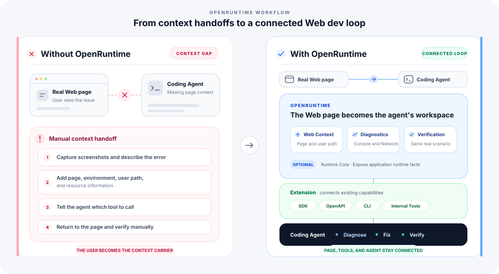

<p align="center">
  
</p>

<h1 align="center">OpenRuntime</h1>

<p align="center">
<b>Help coding agents reproduce, diagnose, and verify issues in real web scenarios.</b>
<br/>
A web development debugging tool for coding agents.
</p>

---

English | [中文](./README.zh-CN.md)

Agent entry point: [OpenRuntime Skill](./skills/openruntime/SKILL.md)

# OpenRuntime

OpenRuntime is a **web development debugging tool** for coding agents.

OpenRuntime makes the web page the coding agent's point of entry. It connects page context, browser capabilities, and the team's existing development and debugging tools so the agent can reproduce, diagnose, and verify issues directly in real web scenarios.

Starting from the current page, an agent can call existing SDKs, OpenAPIs, CLIs, and diagnostic capabilities without requiring a person to extract page information and connect the tools first.

The coding agent reads and modifies code. OpenRuntime prepares reusable browser context and exposes page operations, browser diagnostics, and result verification as directly callable capabilities. Teams can use Extensions to connect their own accounts, environments, internal platforms, focused diagnostics, and verification workflows.

---

## Why OpenRuntime

Coding agents can already read and modify code, and they can call many development tools. But real web development issues usually happen in the page itself: users see a page, while diagnosing the problem requires its state, runtime environment, business context, and the team's existing diagnostic capabilities.

That information and those capabilities are usually scattered across:

- User actions and runtime state on the page
- Browser diagnostics such as Console and Network
- Existing SDKs, OpenAPIs, CLIs, and internal platforms

An agent often still needs a person to explain what the current page represents and which capability to call next.

OpenRuntime makes the web page the agent's point of entry, connecting page context, browser diagnostics, and the team's existing tools so the agent can reproduce, diagnose, and verify issues directly in the real scenario.

Teams can use Extensions to bring existing capabilities into the current page scenario without rebuilding a separate tool system for agents. Once a workflow works, other agents and CI can keep using it as a durable team asset.

## What OpenRuntime Changes

<p align="center">
  
</p>

OpenRuntime reduces the cost of connecting web pages with agent capabilities. Users no longer need to carry context between the page, development tools, and the agent.

## A Real Web Issue Debugging Flow

Consider a user reporting, "The page shows an error after I click Submit":

1. The agent opens the real web page, follows the relevant user journey, and reproduces the issue.
2. OpenRuntime collects page context and diagnostic evidence such as Console, Network, screenshots, and runtime state.
3. When business information is needed, an Extension uses the current page to connect existing SDKs, OpenAPIs, CLIs, or internal platforms.
4. The coding agent modifies the source code based on the diagnosis.
5. OpenRuntime returns to the same page scenario to verify the change.

The point of OpenRuntime is not to teach an agent how to operate a browser. It is to make the web page a scenario where the agent can work directly.

See [Coding Agent Development Debugging Loop](./docs/agent-devloop.md) for the complete workflow.

## Core Capabilities

| Module | Responsibility | Entry point | Page integration required |
| --- | --- | --- | --- |
| Web Context & Diagnostics | Make a real web page the agent's point of entry and provide page context, browser diagnostics, and same-scenario verification | OpenRuntime CLI | No |
| Extensions | Connect the web page with the team's existing development and debugging capabilities | CLI commands, Extension API | No |
| Runtime Core | Expose application-internal facts that browser information cannot represent reliably | `@openruntime/core`, framework plugins | Yes |

### Web Context & Diagnostics

OpenRuntime makes a real web page the agent's point of entry, providing page context, page operations, browser diagnostics, and same-scenario verification after a code change.

These capabilities include the current page and user journey, page operations such as `click`, `fill`, and `eval`, and diagnostic evidence from Console, Network, Screenshot, and Coverage. Agents can call them directly through the OpenRuntime CLI without Runtime Core.

[CLI Reference](./docs/cli-reference.md)

When a script must manage the complete browser flow, see [Automating with OpenRuntime CLI](./docs/cli-automation-scripts.md).

### Extensions

Extensions are the mechanism for connecting a web page with the team's existing development capabilities.

An Extension can identify applications, environments, and resources from the current page, call existing SDKs, OpenAPIs, CLIs, or internal platforms, and expose diagnostic and verification workflows that previously required a person to connect them.

[Using Extensions](./docs/extensions.md) · [CLI Extension Development](./docs/cli-extensions.md) · [Extension API Reference](./docs/extension-api.md)

#### Official Extensions

Focused capabilities are published as optional Extension packages and installed only when needed:

| Package | Command | Purpose | Guide |
| --- | --- | --- | --- |
| `@openruntime/extension-memory` | `openruntime memory` | Repeat a real page journey and check memory, DOM-node, and listener growth. | [Memory Analysis](./docs/memory-analysis.md) |
| `@openruntime/extension-code-usage` | `openruntime code-usage` | Map recorded code execution back to chunks, source files, and dependencies. | [Code-Usage Analysis](./docs/code-usage-analysis.md) |
| `@openruntime/extension-imitate` | `openruntime record` | Record a browser walkthrough and generate a reusable script draft. | [Record Browser Workflows](./docs/record-browser-workflows.md) |
| `@openruntime/extension-troubleshooting` | `openruntime verify` | Verify that a page-declared business target reaches the expected result. | [Runtime Core API](./docs/runtime-core-api.md) |

Install an Extension with:

```bash
openruntime extensions add @openruntime/extension-memory
```

Installed Extension commands appear in `openruntime --help` and run through the same CLI, browser sessions, and login state as the built-in commands.

### Runtime Core

Runtime Core is an optional page-side API. When the DOM, Console, Network, and other browser information cannot represent application state reliably, Runtime Core can expose more granular application-internal facts to the agent.

It supports registering Targets, updating Snapshots, recording Events, declaring Actions, and running `waitFor`. OpenRuntime works without Runtime Core, and regular pages do not need to integrate it.

[Runtime Core API](./docs/runtime-core-api.md)

## Environment Setup

### Browser Authentication

OpenRuntime can reuse an existing Chrome profile or browser state, and it can use encrypted credentials explicitly supplied by the user. These capabilities help an agent enter a real web environment without bypassing authorization.

[Browser Authentication and State](./docs/browser-auth.md)

## Focused Debugging Scenarios

- [Memory analysis](./docs/memory-analysis.md): determine whether memory, DOM nodes, and listeners keep growing across a real page journey.
- [Chunk and code-usage analysis](./docs/code-usage-analysis.md): map browser code execution back to chunks, source files, and packages.
- [Record browser workflows](./docs/record-browser-workflows.md): turn a manual demonstration into a script draft that can be inspected and verified.
- [Browser connections and multiple Runtimes](./docs/runtime-connections.md): preserve sessions and select the right Runtime in micro-frontend pages.

## Components

```text
                  Coding Agent
                       │
                       ▼
                  OpenRuntime
       ┌──────────────────────────────────┐
       │ Web page: the agent's entry point│
       │                                  │
       │ Page context, browser operations │
       │ and diagnostics                  │
       │ Before-and-after verification    │
       │                                  │
       │ Extensions                       │
       │ Connect existing SDKs, APIs,     │
       │ CLIs, and internal platforms     │
       │                                  │
       │ Runtime Core                     │
       │ Expose application facts         │
       └──────────────────────────────────┘
```

## Documentation

- [Coding Agent Development Debugging Loop](./docs/agent-devloop.md)
- [CLI Reference](./docs/cli-reference.md)
- [Browser Authentication and State](./docs/browser-auth.md)
- [Using Extensions](./docs/extensions.md)
- [CLI Extension Development](./docs/cli-extensions.md)
- [Extension API Reference](./docs/extension-api.md)
- [Runtime Core API](./docs/runtime-core-api.md)
- [Standalone Automation](./docs/cli-automation-scripts.md)
- [Release Process](./docs/release.md)

## Contribution

Please read the [contributing guide](./CONTRIBUTING.md) and let's build OpenRuntime together.

## Credits

OpenRuntime uses [agent-browser](https://github.com/vercel-labs/agent-browser) as its default browser execution layer. Thanks to the agent-browser authors and contributors.

Extensions execute local code. Install and load only trusted content. Login-state files contain sensitive data and should remain in trusted environments.

## License

OpenRuntime is [MIT licensed](./LICENSE).
