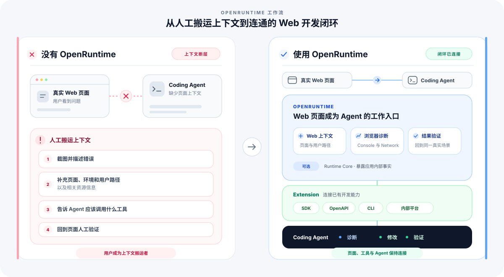

<p align="center">
  
</p>

<h1 align="center">OpenRuntime</h1>

<p align="center">
<b>帮助 Coding Agent 在真实 Web 场景中完成问题复现、诊断和验证。</b>
<br/>
面向 Coding Agent 的 Web 开发调试工具。
</p>

---

中文 | [English](./README.md)

Agent 使用入口：[OpenRuntime Skill](./skills/openruntime/SKILL.md)

# OpenRuntime

OpenRuntime 是面向 Coding Agent 的 **Web 开发调试工具**。

OpenRuntime 将 Web 页面作为 Coding Agent 的工作入口，将页面上下文、浏览器能力和团队已有的开发调试工具连接起来，让 Agent 可以直接在真实 Web 场景中完成问题复现、诊断和验证。

Agent 可以基于当前页面调用已有的 SDK、OpenAPI、CLI 和诊断能力，不再需要人先提取页面信息，再帮助它串联不同工具。

Coding Agent 负责阅读和修改代码；OpenRuntime 负责准备可复用的浏览器上下文，并把页面操作、浏览器诊断和结果验证封装成可以直接调用的能力。团队可以通过 Extension 接入自己的账号、环境、内部平台、专项诊断和验证流程。

---

## Quick Start

先全局安装一次 OpenRuntime CLI：

```bash
npm install --global @openruntime/cli
openruntime check --fix
openruntime --help
```

直接体验已经部署的订单工作台，不需要克隆仓库，也不需要先获取源码：

[打开体验页](https://2heal1.github.io/openruntime/quickstart/) ·
[查看 Agent 引导流程](./docs/quick-start.zh-CN.md)

安装 CLI 和 [OpenRuntime Skill](./skills/openruntime/SKILL.md) 后，对 Agent 说：

```text
使用 OpenRuntime 完成官方 Quick Start：操作订单页面，触发并定位库存失败，
使用页面声明的重试动作恢复流程，并在最后打开 Code Usage 报告。
```

## 为什么需要 OpenRuntime

Coding Agent 已经可以阅读和修改代码，也可以调用各种开发工具。但真实 Web 开发中的问题通常发生在页面场景中：用户看到的是一个页面，而定位问题需要结合页面状态、运行环境、业务上下文以及团队已有的诊断能力。

这些信息和能力通常分散在不同地方：

- 页面中的用户操作和运行状态
- 浏览器提供的 Console、Network 等调试信息
- 团队已有的 SDK、OpenAPI、CLI 和内部平台

Agent 往往还需要人帮助它理解当前页面代表什么，以及接下来应该调用哪些能力。

OpenRuntime 将 Web 页面作为 Agent 的工作入口，连接页面上下文、浏览器诊断能力和团队已有工具，让 Agent 可以直接在真实场景中完成问题复现、诊断和验证。

团队可以通过 Extension 将已有能力接入当前页面场景，而不需要重新建设一套 Agent 工具体系。已经跑通的方法可以继续交给其他 Agent 和 CI 使用，形成长期积累。

## OpenRuntime 改变了什么

<p align="center">
  
</p>

OpenRuntime 降低了 Web 页面和 Agent 能力之间的连接成本，用户不再需要充当页面、开发工具和 Agent 之间的上下文搬运者。

## 一个真实的 Web 问题调试流程

以用户反馈“点击提交后页面报错”为例：

1. Agent 打开真实 Web 页面，进入对应的用户操作路径并复现问题。
2. OpenRuntime 获取页面上下文、Console、Network、截图和运行状态等诊断信息。
3. 如果需要业务信息，Extension 根据当前页面连接已有的 SDK、OpenAPI、CLI 或内部平台。
4. Coding Agent 根据诊断结果修改源码。
5. OpenRuntime 回到相同页面场景验证修改结果。

OpenRuntime 的核心不是让 Agent 学会操作浏览器，而是让 Web 页面成为 Agent 可以直接工作的场景入口。

完整流程见 [Coding Agent 开发调试闭环](./docs/agent-devloop.zh-CN.md)。

## 核心能力

| 模块 | 职责 | 使用入口 | 是否需要页面接入 |
| --- | --- | --- | --- |
| Web Context & Diagnostics | 将真实 Web 页面作为 Agent 工作入口，提供页面上下文、浏览器诊断和同场景验证 | OpenRuntime CLI | 否 |
| Extensions | 连接 Web 页面和团队已有的开发调试能力 | CLI 命令、Extension API | 否 |
| Runtime Core | 暴露浏览器信息无法稳定表达的应用内部事实 | `@openruntime/core`、框架插件 | 是 |

### Web Context & Diagnostics

OpenRuntime 将真实 Web 页面作为 Agent 的工作入口，提供页面上下文、页面操作、浏览器诊断以及修改后的同场景验证能力。

这些能力包括当前页面和用户路径，`click`、`fill`、`eval` 等页面操作，以及 Console、Network、Screenshot 和 Coverage 等诊断信息。Agent 可以通过 OpenRuntime CLI 直接调用，不依赖 Runtime Core。

[CLI 命令参考](./docs/cli-reference.zh-CN.md)

对于需要登录的页面，OpenRuntime 可以复用已有的 Chrome Profile、浏览器状态或用户明确提供的加密登录凭据，在原有权限范围内完成调试和验证。

[浏览器登录与状态复用](./docs/browser-auth.zh-CN.md)

完整浏览器流程需要由脚本管理时，见 [使用 OpenRuntime CLI 编写自动化脚本](./docs/cli-automation-scripts.zh-CN.md)。

### Extensions

Extension 是连接 Web 页面和团队已有开发能力的扩展机制。

它可以根据当前页面识别应用、环境和资源，调用已有的 SDK、OpenAPI、CLI 或内部平台，将原本需要人工串联的诊断和验证流程提供给 Agent。

[Extension 使用指南](./docs/extensions.zh-CN.md) · [CLI Extension 开发指南](./docs/cli-extensions.zh-CN.md) · [Extension API 参考](./docs/extension-api.zh-CN.md)

#### 官方扩展

专项能力以可选包发布，需要时再单独安装。CLI Extension 在页面外增加命令；框架接入运行在应用内部，暴露框架本来就知道的事实：

| 扩展包 | 入口 | 用途 | 指南 |
| --- | --- | --- | --- |
| `@openruntime/extension-memory` | `openruntime memory` | 重复真实页面流程，检查内存、DOM 节点和监听器是否持续增长。 | [内存分析](./docs/memory-analysis.zh-CN.md) |
| `@openruntime/extension-code-usage` | `openruntime code-usage` | 把页面中的代码执行情况还原到分块、源码文件和依赖包。 | [代码使用分析](./docs/code-usage-analysis.zh-CN.md) |
| `@openruntime/extension-imitate` | `openruntime record` | 录制一次浏览器操作并生成可以继续检查的脚本草稿。 | [录制浏览器操作](./docs/record-browser-workflows.zh-CN.md) |
| `@openruntime/extension-troubleshooting` | `openruntime verify` | 验证页面声明的业务目标是否到达预期结果。 | [Runtime Core API](./docs/runtime-core-api.zh-CN.md) |
| `@openruntime/modern-plugin` | Modern.js runtime plugin | 暴露 Modern.js 已知的应用、路由、loader、路由组件、SSR、hydration 和导航状态。 | [Modern.js 接入](./docs/modernjs-integration.zh-CN.md) |
| `@module-federation/observability-plugin` | Module Federation runtime plugin | 通过 MF observability 记录 consumer、remote、manifest、remoteEntry、expose、shared 依赖和运行时错误证据。 | [Module Federation 可观测接入](./docs/module-federation-observability.zh-CN.md) |

安装 CLI Extension：

```bash
openruntime extensions add @openruntime/extension-memory
```

安装后的扩展命令会出现在 `openruntime --help` 中，并复用同一个 CLI、浏览器会话和登录状态。框架接入包是应用依赖，需要在对应框架中配置，本身不会增加一条 CLI 命令。

### Runtime Core

Runtime Core 是可选的页面侧 API。当页面 DOM、Console、Network 等浏览器信息无法稳定表达应用状态时，Runtime Core 可以向 Agent 暴露更细粒度的应用内部事实。

它支持注册 Target、更新 Snapshot、记录 Event、声明 Action 和执行 `waitFor`。没有 Runtime Core 也可以使用 OpenRuntime，普通页面不需要接入。

[Runtime Core API](./docs/runtime-core-api.zh-CN.md)

## Examples

下面的例子按照用户可以完成的结果组织。可以先选择与当前任务最接近的例子体验完整流程，再查看背后的命令和接入方式。

### 直接体验

#### [完成在线 Quick Start](./docs/quick-start.zh-CN.md)

在一个公开页面里完成操作、查看 Network 和 Console、读取应用声明的状态、执行安全恢复，
最后打开高阶代码使用报告，全程不需要克隆仓库。

#### [录制一次真实操作并生成可重复脚本](./docs/record-browser-workflows.zh-CN.md)

在可见浏览器中演示一次流程，让 Agent 根据操作记录、页面上下文和可选语音说明生成脚本草稿。

**演示视频**

https://github.com/user-attachments/assets/45669f30-0c10-4a04-9926-5b796c4be946

#### [检查真实页面流程中的内存增长](./docs/memory-analysis.zh-CN.md)

重复同一段用户操作，判断 JavaScript 内存、DOM 节点和事件监听器是否持续增长。

#### [分析页面加载和实际执行的代码](./docs/code-usage-analysis.zh-CN.md)

对比首屏与后续操作，查看分块、源码文件和依赖包的加载与执行情况。

### 接入参考

#### [让 Agent 读取应用状态并执行页面声明的动作](./demos/bridge-readonly/README.md)

运行一个订单页面，读取状态和事件，执行页面允许的刷新动作并等待最终结果。

#### [把团队已有工具接到当前页面](./demos/cli-extension/README.md)

创建一个本地 Extension，读取当前页面并参与页面打开、技术栈识别和关闭流程。

## 组成

```text
                  Coding Agent
                       │
                       ▼
                  OpenRuntime
       ┌──────────────────────────────────┐
       │ Web 页面：Agent 的工作入口       │
       │                                  │
       │ 页面上下文、浏览器操作与诊断     │
       │ 修改前后的结果验证               │
       │                                  │
       │ Extensions                       │
       │ 连接团队已有 SDK / API / CLI     │
       │ 和内部平台                       │
       │                                  │
       │ Runtime Core                     │
       │ 获取应用内部事实                 │
       └──────────────────────────────────┘
```

## 文档

- [Quick Start](./docs/quick-start.zh-CN.md)
- [Coding Agent 开发调试闭环](./docs/agent-devloop.zh-CN.md)
- [CLI 命令参考](./docs/cli-reference.zh-CN.md)
- [浏览器登录与状态复用](./docs/browser-auth.zh-CN.md)
- [浏览器连接与多 Runtime](./docs/runtime-connections.zh-CN.md)
- [Extension 使用指南](./docs/extensions.zh-CN.md)
- [CLI Extension 开发指南](./docs/cli-extensions.zh-CN.md)
- [Extension API 参考](./docs/extension-api.zh-CN.md)
- [Runtime Core API](./docs/runtime-core-api.zh-CN.md)
- [自动化脚本](./docs/cli-automation-scripts.zh-CN.md)
- [发版流程](./docs/release.zh-CN.md)

## 参与贡献

请阅读 [贡献指南](./CONTRIBUTING.zh-CN.md) 来共同参与 OpenRuntime 的建设。

## Credits

OpenRuntime 使用 [agent-browser](https://github.com/vercel-labs/agent-browser) 作为默认的浏览器执行能力。感谢 agent-browser 的作者和贡献者。

Extensions 会执行本机代码，只安装和加载可信内容。登录状态文件包含敏感信息，应只保存在可信环境中。

## 许可证

OpenRuntime 基于 [MIT 许可证](./LICENSE) 发布。
