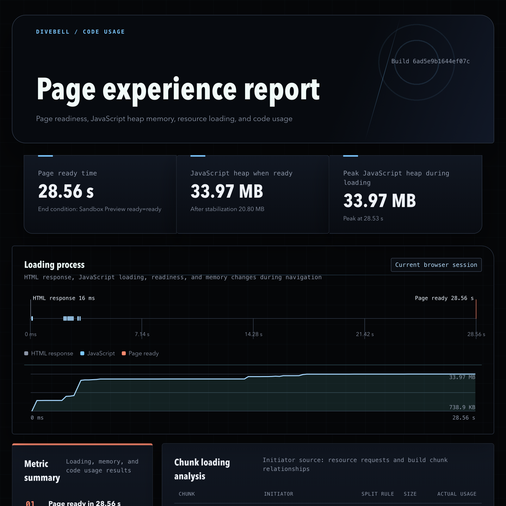

# Chunk and Code-Usage Analysis

This optional analysis maps code recorded in the browser back to build chunks, application files, workspace packages, and third-party dependencies. It helps identify code that may be loaded too early or split more effectively.

> Ask your Agent: `Run divebell extensions add @divebell/extension-code-usage to install the Extension, then run divebell code-usage --skill and follow the returned Skill to analyze the current project and open a complete page-experience and code-usage report for the current page.`

## What the report shows

After installing `@divebell/extension-code-usage`, you can generate a code-usage report that
combines optional page-readiness and loading-memory measurements with complete built-file size
for chunks and actual execution across application code, third-party dependencies, and files.
Figure 1 shows populated readiness and heap measurements together with the loading timeline and
memory curve for the recorded phase.



Open a file from the report to see which code actually executed in the selected phase, as shown in
Figure 2. Blue marks executed ranges; unhighlighted code did not execute.


## How to use

Basic memory checks do not need this setup. See the [Memory Analysis Guide](memory-analysis.md) when the question is whether a page journey causes sustained memory growth.

Install Divebell globally, then add the analysis command:

```bash
npm install --global @divebell/cli
divebell extensions add @divebell/extension-code-usage
```

Do not add the CLI to the application. Only the matching build integration
belongs in the project.

### How it works

```text
Build plugin creates a Chunk Map and source maps
                    ↓
Divebell records code executed by the target page
                    ↓
The analysis combines both sets of evidence
                    ↓
Divebell creates JSON and an interactive report
```

Build metadata, JavaScript files, source maps, and the deployed page must come from the same build. Divebell stops attribution when it cannot identify one exact build file instead of guessing from a filename.

### 1. Add a build plugin

#### Modern.js

The runtime side of `@divebell/modern-plugin` is WIP, but the build-time
`/chunk-map` entry below does not depend on the unreleased Modern.js lifecycle
hooks and remains available for code-usage analysis.

Install `@divebell/modern-plugin`, then add:

```ts
import { appTools, defineConfig } from '@modern-js/app-tools';
import { divebellChunkMapPlugin } from '@divebell/modern-plugin/chunk-map';

export default defineConfig({
  plugins: [appTools(), divebellChunkMapPlugin()],
});
```

#### Rspack

Install `@divebell/rspack-plugin`, then add:

```ts
import { DivebellChunkMapRspackPlugin } from '@divebell/rspack-plugin';

export default {
  plugins: [new DivebellChunkMapRspackPlugin()],
};
```

Both plugins write `divebell-chunks.json`. Keep the matching JavaScript files and `.js.map` files so the analysis can map built code back to source files and packages.

Use `filename` to place the Chunk Map elsewhere:

```ts
divebellChunkMapPlugin({ filename: 'meta/chunks.json' })
```

The Rspack plugin supports the same option.

### 2. Measure page readiness and loading memory before coverage

A standard report includes page-ready time and loading memory. They must be
measured without code coverage, before coverage recording starts. First open
the page with the measurement recorder:

```bash
divebell open https://example.com/ --code-usage-experience
divebell code-usage experience \
  --output /tmp/first-screen.experience.json \
  --label first-screen
```

Ask the page owner for a business-ready signal before measurement. When one is
available, append exactly one ready option to `divebell open`:

```bash
--code-usage-ready-measure <performance-measure-name>
--code-usage-ready-mark <performance-mark-name>
--code-usage-ready-selector <css-selector>
```

When none is supplied, Divebell uses `page-stable@3`: DOMContentLoaded and the
document root must exist, first contentful paint must occur when paint timing is
supported, no more than two ordinary fetch/XHR requests may remain in flight,
tracked initial requests (including those started before DOMContentLoaded)
should drain, JS/CSS/WASM fetches must
finish, and relevant DOM mutations, long tasks, and script loads must remain
quiet for 500 ms. If the initial request burst cannot drain within 10 seconds,
the heuristic falls back to network-idle-2. Ordinary fetch/XHR completion resets
the quiet window when all tracked requests have drained; non-render completion
while other requests remain does not. The maximum wait is 30 seconds.
This is reported as a tool-selected, inferred ready signal rather than business
truth.
`ready.initialNetworkDrain` contains `fallbackUsed`, `elapsedMs` since
DOMContentLoaded, and `inflightRequests` at readiness. A fallback is explicitly
reported and does not claim observed network settling. These fields are absent
on older recordings and explicit business signals. Version 3 fixes a
pre-DOMContentLoaded request-drain error in version 2, so comparison runs must
use the same version; recollect both sides when upgrading.
The observer stores the timestamp when the condition happens; command execution
latency is not included.

Repeat this measurement from a fresh recorder-enabled page load for every
report phase and keep the labels identical to the coverage labels. Skip this
step only for an explicitly requested code-only report; that report hides the
page-readiness and memory sections rather than displaying empty values.

### 3. Record representative page journeys

Start precise code coverage in a fresh blank page target, then navigate:

```bash
divebell tab new about:blank
divebell coverage start
divebell goto https://example.com/
```

After verifying the actual page and reaching the recorded ready boundary, save
the first phase:

```bash
divebell code-usage capture --chunk-map /path/to/production-dist/divebell-chunks.json \
  --output /tmp/first-screen.coverage.json \
  --label first-screen
```

Continue with `click`, `fill`, `goto`, or a page-declared action, then save the next phase and stop:

```bash
divebell code-usage capture --chunk-map /path/to/production-dist/divebell-chunks.json \
  --output /tmp/orders.coverage.json \
  --label orders --stop
```

Each capture freezes and resets execution counts, so every phase describes only
the work performed since the previous capture. The command attaches the actual
runtime source of matching scripts for build-identity and wrapper-offset checks;
measurement and identity acceptance rules are in the `analyze-code-usage` Skill.

### 4. Analyze the recording

```bash
divebell code-usage analyze \
  --chunk-map /path/to/production-dist/divebell-chunks.json \
  --coverage /tmp/first-screen.coverage.json \
  --coverage /tmp/orders.coverage.json \
  --experience /tmp/first-screen.experience.json \
  --experience /tmp/orders.experience.json \
  --output /tmp/code-usage-report.json
```

By default, JavaScript and source maps are read beside the Chunk Map. If they are stored elsewhere, pass the build output explicitly:

```bash
divebell code-usage analyze \
  --chunk-map /path/to/metadata/divebell-chunks.json \
  --assets /path/to/production-dist \
  --coverage /tmp/first-screen.coverage.json \
  --output /tmp/code-usage-report.json
```

`--chunk-map` and `--assets` also accept HTTP or HTTPS URLs. This is useful for
a public deployment that keeps its Chunk Map, JavaScript, and source maps
together:

```bash
divebell code-usage analyze \
  --chunk-map https://example.com/app/divebell-chunks.json \
  --coverage /tmp/first-screen.coverage.json \
  --coverage /tmp/orders.coverage.json \
  --output /tmp/code-usage-report.json
```

When the Chunk Map is remote and `--assets` is omitted, its URL directory is
used as the asset base. Only analyze trusted deployments: the command downloads
the referenced build files, and every file must still come from the exact build
used by the recorded page.

Repeat `--coverage` in the order the phases should appear in the report. The
optional `--experience` files must cover the same labels exactly.

### 5. Open the report

```bash
divebell code-usage report /tmp/code-usage-report.json
```

The command creates an HTML report and opens it. Use `--no-open` to create files only or `--output <report.html>` to choose the location.

For large reports, start the local streaming viewer:

```bash
divebell code-usage serve /tmp/code-usage-report.json --port 4173
```

The command result prints the HTML path, its data-file path, and the optional
`-code` directory. Keep all of them together when moving or sharing a report;
the HTML is the entry point, not the complete artifact by itself.

## Read the result

The report presents each phase by application source, dependency, complete file list, and chunk. A useful review order is:

1. inspect the phase's ranked opportunities and start from the largest
   `potentialSavingsBytes` value;
2. explain its current raw size, `coverageFloorBytes`,
   `potentialSavingsBytes`, loading role, source-map coverage, confidence, and
   contributing sources or packages;
3. confirm why the chunk was requested and which split rule produced it;
4. record other important user journeys before deciding that code is unused;
5. change lazy loading or chunking; and
6. rebuild and repeat the same measurements with the exact same ready spec.

The ranking uses observed unexecuted bytes, not ease of implementation or
percentage alone. For compatibility, `potentialSavingsBytes` remains an alias
for `unusedBytes = totalBytes - usedBytes`, and `coverageFloorBytes` remains an
alias for `usedBytes`. Neither name promises a savings upper bound or a remaining
size floor: deferring a hidden feature can also remove its executed initialization.
Source/package rows overlap chunks and cannot be added to the exclusive ledger.
Trace the complete dependency boundary, then rebuild and recapture to measure net
changes in both total and executed bytes, including new dependencies, duplication,
wrappers and chunk rebalancing. Compression and request count also require
measurement. Always compare both the target chunk and all JavaScript requested
in the phase.

“Unused” means that code did not execute in the explicitly recorded journeys. It does not prove that the code can be deleted. Chunk sizes describe complete built JavaScript files; source and dependency sizes describe source-mapped bytes. Neither is compressed download size or original source-file size.

Code coverage changes JavaScript-engine behavior. Measure loading speed and memory separately with coverage disabled before accepting an optimization.

## Repository example

Build and serve the production demo:

```bash
pnpm --filter @divebell/demo-modern-basic verify:chunk-map
pnpm --filter @divebell/demo-modern-basic serve
```

In another terminal, run the complete experience check and report server:

```bash
pnpm --filter @divebell/demo-modern-basic verify:experience
pnpm --filter @divebell/demo-modern-basic report:serve
```

The report is available at `http://127.0.0.1:4173/`. Use the same build output for the page, Chunk Map, JavaScript files, and source maps.
