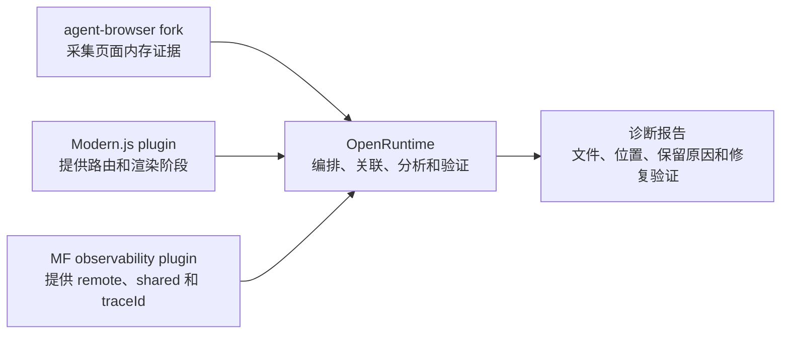

# OpenRuntime 内存泄漏诊断能力规划

## 文档状态

- 状态：提案
- 目标：让开发 Agent 能从“页面存在稳定内存泄漏”继续定位到具体文件、函数、代码位置和保留原因，并在修改后自动复现和验证。
- 范围：浏览器端 JavaScript、DOM 及可由 Chrome 内存能力观察到的页面资源。
- 非目标：第一阶段不覆盖 SSR、Server Loader、BFF 或其他 Node.js 进程的内存；这些进程需要独立的服务端采集链路。

本文按三个部分描述：

1. 整体功能规划及所需能力管理支持。
2. fork agent-browser 后需要实现的能力和实现方式。
3. OpenRuntime、Modern.js 以及后续 Module Federation 接入需要开发的能力。

## 1. 整体功能规划及所需能力管理支持

### 1.1 最终目标

Agent 不应只报告“页面增长了 34 MB”，而应产出类似下面的结论：

> 重复进入和离开 `/orders` 五次后，`OrdersStore` 多出 5 个，共保留 34 MB。对象创建于 `src/pages/orders/useOrdersTable.ts:73`，但真正的保留原因是 `window` 上的 resize 监听仍引用表格实例。该代码属于 `orders` remote。移除监听并销毁表格实例后，相同流程不再持续增长，订单业务状态仍然正常。

要得到这个结果，需要同时回答四个问题：

| 问题 | 主要证据来源 |
| --- | --- |
| 哪次操作触发了泄漏 | OpenRuntime Action、Target、Snapshot、Event 和复现流程 |
| 哪些对象没有释放 | agent-browser 内存快照前后对比 |
| 对象在哪里创建、为什么还活着 | 分配记录、对象保留链和源码映射 |
| 代码属于哪个路由、host、remote 或 shared | Modern.js 生命周期和 MF observability 报告 |

### 1.2 职责边界

#### agent-browser fork

- 复用它已经拥有的 Chrome 连接，不要求用户配置 CDP 地址或端口。
- 负责采集当前指标、对象分配记录和内存快照。
- 管理采集的开始、停止、取消、文件写入和浏览器会话生命周期。
- 只做通用的浏览器级汇总，不理解 OpenRuntime、Modern.js 或 MF 业务概念。

#### OpenRuntime

- 定义并重复执行稳定的复现流程。
- 在流程开始前记录事件位置和业务状态，流程结束后等待明确结果。
- 关联内存证据、OpenRuntime Event、Modern.js 生命周期和 MF 报告。
- 解析前后快照、寻找保留链、还原源码位置、生成候选问题列表。
- 修改代码后重复相同流程，确认泄漏消失且业务功能没有退化。

#### Modern.js plugin

- 提供当前路由、匹配链、loader、路由模块、组件 mount、SSR 和 hydration 阶段。
- 为一次导航或渲染提供稳定标识，帮助内存结果归属到具体路由阶段。
- 在框架能提供可靠 hook 时补充 unmount 和模块身份；不通过 DOM 猜测框架状态。

#### MF observability plugin

- 提供 `traceId`、host、remote、expose、shared、provider、版本和加载阶段。
- 帮助判断问题更可能属于 host、remote 还是 shared。
- OpenRuntime 不直接探测 MF 内部对象；MF 信息应由 MF observability plugin 提供或补齐 hook。

### 1.3 第一阶段端到端流程

一次自动诊断按下面顺序执行：

1. 打开或选择目标浏览器会话。
2. 读取 OpenRuntime Snapshot，并保存当前 `latestEventId`。
3. 等待页面进入稳定状态，触发一次垃圾回收并保存基线快照。
4. 开始记录对象分配位置。
5. 重复执行目标流程，默认至少 5 次。
6. 每次执行都通过 OpenRuntime `wait-for` 或 `verify` 确认进入和退出已经完成。
7. 停止分配记录，再触发一次垃圾回收并保存结束快照。
8. 读取基线之后的 OpenRuntime Event、Modern.js 状态和 MF observability 报告。
9. 比较两份快照，找出数量或保留体积随循环增长的对象。
10. 对候选对象查找创建位置和最短保留链。
11. 通过源码映射还原到本地源文件和代码位置。
12. 结合路由、Action、remote、expose 和 shared 信息确定代码归属。
13. 生成诊断报告和原始证据文件位置。
14. 修改代码后重复相同流程，完成修复验收。

### 1.4 诊断报告最小结构

报告应包含下面的信息，但原始大文件不直接嵌入报告：

| 分类 | 字段 |
| --- | --- |
| 诊断身份 | `captureId`、浏览器 session、页面 URL、开始和结束时间 |
| 复现流程 | 执行的 Action、路由、循环次数、等待和验收条件 |
| OpenRuntime 上下文 | runtime、开始和结束 event id、相关 target 状态变化 |
| Modern.js 上下文 | pathname、route id、navigation id、loader、component、hydration 阶段 |
| MF 上下文 | traceId、host、remote、expose、shared、provider、版本、最终结果 |
| 内存结论 | 基线、峰值、结束值、回收后增量、增长趋势 |
| 泄漏候选 | 对象类型、增长数量、保留体积、创建文件、函数和代码位置 |
| 保留原因 | 根对象到候选对象的保留链、最可能需要清理的代码位置 |
| 可信度 | 高、中、低，以及支持判断的循环次数和证据 |
| 产物 | 基线快照、结束快照、分配记录和源码映射结果的文件路径 |

建议的可信度规则：

- 高：垃圾回收后仍持续增长，至少重复 3 次，创建位置和保留链都能还原到源码，且框架或 MF 归属明确。
- 中：增长可重复，能定位创建位置，但保留链或框架归属不完整。
- 低：只有页面总内存增长，没有稳定对象增量或源码位置。

低可信度结果只能作为继续排查的线索，不应由 Agent 自动修改代码。

### 1.5 能力管理支持

#### 能力发现和版本管理

- OpenRuntime 启动后应自动判断当前 agent-browser 是否支持内存命令。
- 不根据包名判断官方版或 fork，只根据能力和输出版本判断。
- 诊断报告记录 agent-browser、Chrome、OpenRuntime 和框架插件版本。
- 官方 agent-browser 合入同等能力后，OpenRuntime 可以直接切回官方版本，上层接口不变。

#### 采集生命周期管理

- 同一个浏览器页面同一时间只允许一个内存采集任务。
- 支持查询当前任务、正常停止和异常取消。
- 页面关闭、浏览器重启或 daemon 退出时，必须结束采集并关闭文件句柄。
- 采集绑定开始时的页面 target；切换标签页不能悄悄把结束结果写到另一个页面。

#### 资源和文件管理

- 内存快照必须边接收边写文件，不能在 agent-browser 自身内存中完整缓存。
- 默认写入运行时临时目录；只有显式指定输出目录时才长期保留。
- 支持文件大小上限、超时、取消和过期清理。
- CLI 只返回摘要和文件路径，不把大型快照输出到 Agent 上下文。

#### 安全和隐私

- 内存快照可能包含页面文本、接口数据、账号信息和 token，只能保存在本机可信目录。
- 默认不上传、不提交仓库、不写入普通日志。
- 输出报告尽量只保留对象类型、源码位置、数量和体积；展示字符串值时需要截断或脱敏。
- 生产环境采集应显式启用，并允许业务设置输出目录和保留期限。

#### 性能开销管理

- 内存诊断必须按需开启，不能成为普通 `open`、`run-action` 或 `verify` 的默认行为。
- 快照可能暂停页面，诊断流程应标记当前结果来自调试采集。
- 支持配置分配采样精度、调用栈深度、循环次数和稳定等待时间。
- 回归判断应优先比较多次循环后的趋势，不使用单次峰值直接判定泄漏。

### 1.6 交付阶段

| 阶段 | 交付内容 | 完成标准 |
| --- | --- | --- |
| P0 | agent-browser fork 的当前指标、分配采样和快照 | 无额外 CDP 配置；能稳定生成有效产物 |
| P1 | OpenRuntime 手工开始、停止和读取摘要 | CLI 能在当前 session 使用内存能力 |
| P2 | 自动复现、前后对比、保留链和源码还原 | 能在测试页面定位到预设泄漏文件和位置 |
| P3 | Modern.js 路由和渲染阶段关联 | 能说明泄漏发生在哪个路由和生命周期 |
| P4 | MF observability 关联 | 能说明问题属于 host、remote 或 shared，并给出 traceId |
| P5 | 修复后自动重复验证和回归阈值 | 相同流程证明增长消失且业务目标仍通过 |

## 2. fork agent-browser 后要实现什么、怎么实现

### 2.1 fork 策略

- 从一个明确的稳定版本建立 fork；当前评估基于 agent-browser `0.31.2`。
- 内存相关改动保持为独立提交，不混入 OpenRuntime 专属行为。
- 对外命令、JSON 输出和错误码保持通用，便于提交上游。
- 优先向官方提交 issue 或草案 PR；官方未合入时继续发布自有构建。
- OpenRuntime 通过能力发现兼容官方版和自有版，不直接依赖 fork 内部代码。

### 2.2 建议增加的命令

命令名称可在实现前与 agent-browser 上游确认，第一版至少需要：

| 命令 | 作用 |
| --- | --- |
| `memory metrics` | 自动请求垃圾回收后，读取当前页面的 JS heap、DOM 节点等可比较指标；`--no-gc` 只用于高级排查 |
| `memory status` | 查询当前页面是否正在采集、采集类型和开始时间 |
| `memory sampling start` | 开始记录对象分配调用栈 |
| `memory sampling stop` | 停止采样，输出通用汇总并保存原始记录 |
| `memory snapshot` | 生成当前页面的 heap snapshot |
| 底层垃圾回收 | 由 `memory metrics` 和快照流程自动处理，不作为普通用户步骤 |
| `memory cancel` | 取消当前采集并清理状态 |

所有命令都应支持 agent-browser 的普通文本输出和 `--json` 输出。新增命令还需要进入 agent-browser MCP 的 debug 工具组，保持 CLI 与 MCP 能力一致。

### 2.3 CDP 能力映射

fork 直接复用 agent-browser daemon 已经维护的 CDP client 和当前页面 session，不增加用户配置。

| 目标 | Chrome 能力 |
| --- | --- |
| 当前页面指标 | `Performance.getMetrics`、`Memory.getDOMCounters` |
| 主动垃圾回收 | `HeapProfiler.collectGarbage` |
| 分配采样 | `HeapProfiler.startSampling`、`HeapProfiler.stopSampling` |
| 采样中间结果 | `HeapProfiler.getSamplingProfile` |
| heap snapshot | `HeapProfiler.takeHeapSnapshot` 和 snapshot chunk 事件 |

第一版使用 Chrome/Chromium。Lightpanda、Safari 或其他不支持这些能力的引擎应返回明确的“不支持”错误，不能降级成不可靠的页面表达式。

### 2.4 daemon 状态设计

内存采集必须存在于 agent-browser daemon，而不是一次性 CLI 进程中，这样才能覆盖“开始采集、执行多个页面操作、停止采集”的完整区间。

每个活动任务至少保存：

- 采集 id。
- 采集类型：sampling 或 snapshot。
- agent-browser session、页面 target 和页面 URL。
- 开始时间、采样配置和输出位置。
- 当前输出文件、接收进度和取消状态。

状态规则：

- 同一页面已有任务时，再次 start 返回稳定错误。
- stop 必须停止开始时绑定的页面，而不是停止命令执行时恰好激活的页面。
- 页面已关闭时返回“目标已离开”，同时清理任务。
- daemon 关闭时自动 cancel，保证下次启动没有脏状态。

### 2.5 分配采样实现

开始时：

1. 取得当前页面对应的 CDP session。
2. 启用 HeapProfiler。
3. 按配置设置平均采样间隔和最大调用栈深度。
4. 保存采集上下文。

停止时：

1. 对开始时的页面执行 stopSampling。
2. 将完整 profile 写入文件。
3. 按调用栈节点汇总 `selfSize` 和样本体积。
4. 输出前 N 个函数位置，包括函数名、脚本 URL、行列号和分配体积。
5. 关闭 HeapProfiler，并清理活动任务。

agent-browser 只需要提供浏览器级汇总。源码映射、仓库归属、Modern.js 路由和 MF remote 归属放到 OpenRuntime 分析层。

### 2.6 heap snapshot 实现

1. 在调用 takeHeapSnapshot 前订阅 snapshot chunk 和进度事件。
2. 可选地先执行 collectGarbage，减少已经可以回收的噪声。
3. 每收到一个 chunk 就追加到目标文件。
4. 收到完成事件后关闭文件，并验证快照包含合法的 metadata、nodes、edges 和 strings。
5. 返回文件路径、文件大小、采集时间和页面身份。

不能先把所有 chunk 放进数组再一次性写文件，否则诊断大型页面时 agent-browser 自身可能出现内存问题。

### 2.7 agent-browser 内不做的事情

为控制 fork 差异和提高上游合入概率，下面能力不进入 agent-browser 核心：

- 不解析 OpenRuntime Target、Action 或 Event。
- 不判断某个对象属于 Modern.js 路由或 MF remote。
- 不读取业务仓库源码。
- 不解析私有 source map 并修改代码。
- 不根据单次内存增长直接输出“泄漏”。
- 不把 heap snapshot 内容直接打印到终端。

这些能力由 OpenRuntime 负责，因为 OpenRuntime 拥有复现流程、源码工作区和框架上下文。

### 2.8 测试和验收

fork 至少需要下面的测试：

#### 单元测试

- 命令参数、JSON 输出和稳定错误码。
- sampling start、stop、status、cancel 的状态转换。
- 页面切换、页面关闭和 daemon 退出时的清理。
- snapshot chunk 流式写入和不完整文件处理。

#### 端到端测试

- 使用一个确定会保留对象的测试页面，循环操作后能观察到候选对象增长。
- 修复版测试页面执行相同流程后不持续增长。
- `memory snapshot` 生成的文件能被标准 heap snapshot 解析器读取。
- sampling 输出包含预设函数的脚本 URL 和位置。
- 不传任何 CDP 参数即可完成全部操作。
- 多标签页时采集始终绑定开始时的页面。
- 不支持的浏览器引擎返回明确错误。

#### 发布验收

- fork 的 macOS 和 Linux 目标平台能够安装并运行。
- 原有 agent-browser 核心命令和测试全部通过。
- memory 命令的 CLI、JSON 和 MCP 输出保持一致。
- 快照中途取消后没有残留进程、任务和临时文件句柄。

## 3. OpenRuntime 及 Modern.js 需要开发支持哪些功能

### 3.1 当前前置事实

- OpenRuntime 统一使用 `agent-browser`，页面操作和内存采集共用同一个浏览器会话。
- OpenRuntime 已在现有 `BrowserRunner` 抽象下加入 agent-browser runner，底层命令没有散落到各个上层功能中。
- Modern.js plugin 已提供 app、route、SSR、hydration、loader、route component module-load 和 mount 状态。
- OpenRuntime 的 Modern.js plugin 已能消费明确的 unmount 事件；Modern.js 主仓库仍需提供或确认正式 hook 会实际送出该事件。
- Garfish 接入已经具有 mount、unmount 和 destroy 相关信号，可以先作为子应用释放诊断的参考实现。

### 3.2 OpenRuntime 浏览器层

#### 新增 agent-browser runner

- 实现与现有 `BrowserRunner` 一致的 agent-browser 适配器。
- 复用 OpenRuntime session、浏览器 profile、可见/无头模式和关闭语义。
- 将 OpenRuntime 的页面操作映射到 agent-browser 命令，保持现有 CLI 用户体验。
- 增加能力探测，确认当前可执行文件是否支持 memory 命令和对应输出版本。
- agent-browser 不可用时直接返回明确的安装或路径错误，不再切换到另一套浏览器实现。

#### OpenRuntime 内存命令

第一阶段提供底层命令透传：

- 当前内存指标。
- 开始和停止分配采样。
- 生成基线和结束快照。
- 查询和取消采集。

第二阶段增加面向 Agent 的组合命令。建议以 `diagnose memory` 为入口，而不是让 Agent 手动拼接十几个命令。

组合命令支持两类流程：

1. OpenRuntime Action 流程：执行 Action，等待或验收一个 Target。
2. 可复用脚本流程：由页面命令或独立脚本定义进入、操作、离开和最终验收。

Modern.js 路由跳转可以基于已经存在的 `modern.route.navigate` Action 形成预置流程，但仍保留脚本入口，以覆盖复杂业务交互。

### 3.3 OpenRuntime 诊断编排

诊断任务需要保存独立上下文：

- `captureId`。
- 浏览器 session、runtime 和 URL。
- 开始时的 `latestEventId`。
- 执行的 Action 或脚本标识。
- 循环次数、等待条件和最终验收条件。
- 基线、sampling 和结束快照文件。
- Modern.js 路由身份和 MF traceId。

执行规则：

- 只有业务流程已经通过一次正常验收后，才开始重复内存诊断，避免把功能失败误判为内存问题。
- 每次循环必须等待明确的进入完成和退出完成状态。
- 结束后只读取 `latestEventId` 之后的 Event，避免把旧操作混入本次报告。
- `runAction` 成功不等于流程完成，仍然使用 `wait-for` 或 `verify` 验证结果。
- 默认至少重复 5 次；可以按测试页面和采样开销配置。

### 3.4 OpenRuntime 内存分析器

分析器由 OpenRuntime 或独立的 OpenRuntime 包提供，不放进 agent-browser daemon。

需要实现：

1. 解析 Chrome heap snapshot 的 nodes、edges 和 strings。
2. 比较基线和结束快照中的对象数量、shallow size 和 retained size。
3. 识别重复循环后仍增长的对象集合。
4. 计算候选对象到 GC root 的保留路径。
5. 区分常见根来源，例如 window listener、timer、observer、全局缓存、pending promise、detached DOM 和框架注册表。
6. 合并 allocation sampling 的创建调用栈。
7. 通过 source map 将脚本 URL、行列号还原到本地源文件。
8. 将本地文件映射到当前工作区、Modern.js 路由模块或 MF remote 仓库。
9. 按证据完整度和重复次数计算可信度。
10. 输出最小修改建议，但只有高可信度候选允许进入自动修改流程。

源码映射规则：

- 开发环境优先使用页面提供的 source map。
- 生产环境使用本地或构建系统保存的私有 source map，不要求公开暴露。
- 没有 source map 时，只报告 bundle URL 和位置，不声称已经定位到原始 TypeScript/TSX 文件。

### 3.5 OpenRuntime 数据模型边界

第一版不修改 Core 数据模型：

- 原始 heap snapshot 和 sampling profile 是诊断产物，不是 Target。
- 不把每个采样点写进 Event Log。
- 不把大型分析结果写进 Snapshot。
- OpenRuntime 报告只保存摘要、关联 id 和产物路径。

如果后续需要持续集成中的内存门禁，可以增加独立的“内存质量”结果，但不要改变业务 Target 或 MF remote 的加载状态。例如 remote 可以成功加载，同时内存质量验收失败；这两个结论必须分别表达。

### 3.6 Modern.js plugin 开发

#### 第一版复用现有能力

现有能力已经可以提供：

- 当前 pathname 和匹配路由链。
- navigation 的 loading/idle 状态。
- loader 的 start、success、redirect 和 error。
- route component 的 module-load、mount 和 error。
- SSR 和 hydration 的状态。

OpenRuntime 可以通过 `snapshot.updated` Event 的完整 payload 还原诊断区间内的路由变化，第一版不需要为每个阶段新建 Target。

#### 需要补充的能力

| 能力 | 目的 |
| --- | --- |
| `navigationId` | 将同一次导航中的 router、loader、component 和内存区间稳定关联 |
| route component unmount | 明确页面资源应该开始释放的时间点 |
| route module identity | 将 bundle/source map 中的文件归到具体 route module |
| mount/unmount 时间 | 判断对象是在进入后创建，还是退出后仍未释放 |
| renderId 延续 | 将 SSR、hydration 和客户端路由阶段关联到同一渲染 |

实现要求：

- 优先使用或补充 Modern.js 正式 hook。
- 如果现有 hook 不提供 unmount 或模块身份，应先在 Modern.js 补 hook，再由 OpenRuntime plugin 消费。
- 不通过 MutationObserver、DOM 特征或 React 内部字段推断路由组件生命周期。
- 不为历史上每个路由创建长期 Snapshot Target；当前路由仍使用聚合 `modern:route`，历史变化保留在 Event Log。

#### Modern.js 验收场景

- 进入 `/orders` 后，能记录 navigation、loader、module-load 和 mount 的统一 navigationId。
- 离开 `/orders` 后，能收到明确 unmount 或等价框架信号。
- 诊断报告能说明候选对象是在 mount 阶段创建，并在 unmount 后仍被保留。
- 修复后相同路由循环不再持续增长，`modern:route` 和业务 Target 仍通过验证。

### 3.7 Module Federation 后续接入

MF 接入放在 MF 仓库的 observability plugin 中，不在 OpenRuntime 中直接探测 `__FEDERATION__` 或运行时内部对象。

第一版优先复用已有报告中的：

- `traceId`。
- `diagnosis.ownerHint`。
- remote、expose 和加载阶段。
- shared 的 provider、requiredVersion、selectedVersion 和 availableVersions。
- `summary.outcome` 和失败/恢复信息。
- `moduleInfo` 中可用于定位 remote 的有限字段。

需要补充时，优先增加下面的通用能力：

- 允许 observability 报告附带外部 correlation tag，用于关联 OpenRuntime `captureId`。
- 暴露 remote 模块执行、业务 ready 和可观察到的销毁阶段。
- 通过 build observability 产物提供 asset、remote、expose 和源码仓库的映射。
- 对 retry 场景使用 retry plugin 自己的 hook 记录重试成功或失败，不从 URL 变化猜测。

MF 归属只能提高诊断范围和责任判断，不能替代 heap snapshot 的创建位置和保留链。最终报告应同时给出：

- 内存证据指向的文件和保留原因。
- MF observability 指向的 host、remote 或 shared。
- 两组证据的关联方式和可信度。

### 3.8 OpenRuntime 与框架侧测试

需要准备一个专用测试应用，至少包含下面四种可控问题：

1. Modern.js 路由组件注册 window listener 但不清理。
2. 路由组件创建 timer 或 observer 但不销毁。
3. MF host 在路由组件中重复创建 Federation 实例。
4. remote 组件卸载后仍由全局缓存或 listener 保留。

每个问题都提供“泄漏版”和“修复版”，自动验证：

- 泄漏版重复流程后对象数量和 retained size 稳定增长。
- 报告能定位到预设文件、函数和保留原因。
- Modern.js 路由或 MF remote 归属正确。
- 修复版执行相同流程后不持续增长。
- 业务 Target、路由 Target 和 MF 加载结果仍然成功。

### 3.9 本阶段完成标准

全部满足下面条件才算完成：

- 用户无需配置 CDP，即可对 OpenRuntime 当前浏览器 session 开始诊断。
- Agent 能用一个组合流程完成基线、复现、结束采集和报告生成。
- 报告至少定位到一个具体本地文件、函数或代码位置，并给出保留链。
- Modern.js 页面能说明问题属于哪个路由和生命周期阶段。
- MF 页面能说明问题属于 host、具体 remote 或 shared，且证据来自 observability plugin。
- 修改代码后，Agent 能重复相同流程证明增长消失。
- 修复验证同时检查业务结果，避免以“内存下降但页面坏了”作为成功。

## 4. 当前准备状态与最终联调入口

截至 2026-07-15，已使用支持内存命令的 agent-browser fork 完成命令和协议核对。该 fork 基于 agent-browser `0.31.2`，内存实现直接复用 daemon 维护的当前页面连接，不要求用户提供 CDP 地址或调试端口。

OpenRuntime 侧已经完成以下接入：

- `agent-browser` 已成为唯一浏览器入口，不再需要浏览器后端切换配置。
- 可通过 `OPENRUNTIME_AGENT_BROWSER_EXECUTABLE` 指定自有构建，不要求它已经安装到全局命令目录。
- OpenRuntime 与 agent-browser 共用稳定的浏览器 session 和持久化 profile，内存采集与页面操作落在同一个页面会话。
- CLI 已提供 `memory metrics`、`memory status`、`memory sampling start`、`memory sampling stop`、`memory snapshot` 和 `memory cancel` 的 JSON 调用入口；`metrics` 默认自动完成垃圾回收，底层清理命令仅保留给高级调用。
- CLI 扩展也能通过 `openruntime.browser.memory` 使用同一组能力，后续组合诊断命令不需要再次接触底层进程调用。
- 已按 fork 的真实 JSON 包装格式接入成功结果；失败时保留稳定错误码和可读错误信息。
- 已按真实命令支持采样间隔、采样文件、Top 函数数量、快照文件、超时、大小限制和是否先回收内存。
- Modern.js 事件已能携带 `navigationId` 和 route module identity，并支持明确的 route component `unmount` 信号；这些信息会进入 `modern:route` 的状态变化历史。

已完成的检查：

- agent-browser 内存专项测试：15 项通过；真实浏览器测试 1 项通过。真实测试覆盖指标读取、分配采样、跨标签页绑定、垃圾回收前后指标和快照文件生成。
- agent-browser 格式检查和静态检查通过。
- OpenRuntime 构建、CLI 文档一致性检查和 Modern.js plugin 的 30 项测试通过。
- OpenRuntime 的内存命令转发、扩展 API 和 agent-browser 返回格式已有自动测试覆盖。

基础能力联调已经完成。下一阶段进入性能优化专项，剩余工作为：

1. 构建 fork 的发布产物，并在实际项目中由 OpenRuntime 指向该文件运行。
2. 使用一个确定泄漏和一个已经修复的页面做端到端对照。
3. 在真实 Modern.js 路由和 MF remote 场景中补齐源码归属、保留链分析和修复后复测。

Modern.js 主仓库还需要提供或确认正式 hook 会实际送出 `navigationId`、`moduleId` 和 `unmount`。OpenRuntime 只消费这些明确事件，不会用 DOM 或 React 内部状态补猜测。

MF 部分仍按既定边界推进：由 MF observability plugin 提供 remote、shared、traceId 和销毁阶段，OpenRuntime 不直接探测 MF 内部全局对象。
